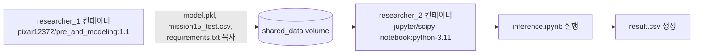

# 미션 15 보고서 초안

## 1) 프로젝트 개요
- 목적: 연구자 1이 학습한 회귀 모델(`model.pkl`)을 연구자 2의 Jupyter 환경에서 재사용해 추론 결과(`result.csv`)를 생성하는 협업 파이프라인을 구축한다.
- 핵심 요구사항:
  - 연구자 1: 전처리 + 모델링 + 저장 자동화(Docker 이미지)
  - 연구자 2: 연구자 1 이미지와 Jupyter를 `docker-compose`로 연결해 추론 수행

## 2) Docker Hub URL
- `https://hub.docker.com/r/pixar12372/pre_and_modeling`
- 사용 태그: `pixar12372/pre_and_modeling:1.1`

## 3) 연구자 1 데이터 전처리/모델링 결과 요약
### 전처리
- 중복 행 제거: `drop_duplicates()`
- 타깃 컬럼 정수화: `Performance Index`를 `int`로 변환
- 범주형 이진 인코딩: `Extracurricular Activities`의 `No/Yes`를 `0/1`로 변환
- 시각화 결과 칼럼 모두 고른 분포를 보여주었고, Performance Index 항목은 전반적으로 정규 분포 형태를 따른다고 판단하여 극단치 제거하지 않음.

### 모델링
- 모델: `LinearRegression` (scikit-learn)
- 데이터 분할: `train_test_split(test_size=0.2, random_state=42)`
- 평가 지표: `RMSE (root_mean_squared_error)`
- 관측 성능: `RMSE = 2.0375`

### 산출물
- 학습 모델: `model.pkl`
- 실행 스크립트: `researcher_1/notebooks/main.py`
- 의존성 파일: `researcher_1/requirements.txt`

## 4) 코드 아키텍처 도식 및 설명


### 동작 설명
- `modeling` 서비스(연구자 1)가 `main.py`를 실행해 모델을 생성한다.
- 생성된 `model.pkl`, `mission15_test.csv`, `requirements.txt`를 공유 볼륨(`/shared`)으로 복사한다.
- `jupyter` 서비스(연구자 2)는 공유 볼륨의 `requirements.txt`를 설치하고 노트북 서버를 시작한다.
- `inference.ipynb`에서 `/shared/model.pkl`과 `/shared/mission15_test.csv`를 읽어 예측 후 `result.csv`를 저장한다.

## 5) 버전 일치 전략
- Python 버전: 연구자 1 이미지를 3.11 기반으로 재빌드하여 연구자 2(`python-3.11`)와 정렬
- 패키지 버전: 연구자 1의 `requirements.txt`를 공유 볼륨으로 전달하고 연구자 2가 동일 파일을 설치
- 효과: 직렬화 모델 로드 시 버전 불일치(특히 NumPy ABI) 리스크 완화

## 6) 재현 절차(검증 방법)
1. 스택 실행
```bash
docker compose -f researcher_2/docker-compose.yml up -d
```
2. 상태 확인
```bash
docker compose -f researcher_2/docker-compose.yml ps -a
```
3. 공유 파일 확인
```bash
docker run --rm -v researcher_2_shared_data:/shared alpine sh -lc "ls -l /shared"
```
4. Jupyter 접속 후 추론
  - `http://localhost:8888/lab`
  - `inference.ipynb` 실행
  - 출력: `/shared/result.csv`

### 성공 신호
- `modeling` 컨테이너 `Exited (0)`
- `jupyter` 컨테이너 `Up (healthy)`
- `/shared`에 `model.pkl`, `mission15_test.csv`, `requirements.txt` 존재
- 추론 완료 후 `result.csv` 생성

### 실패 신호
- `ModuleNotFoundError` 또는 NumPy ABI 에러: 패키지 버전 불일치
- `/shared` 파일 부재: 볼륨 마운트/복사 경로 문제

## 7) 트러블슈팅 요약
- 문제: `pickle.load` 시 `numpy._core` 또는 `_ARRAY_API` 에러 발생
- 원인: 모델 저장 환경과 추론 환경의 NumPy/과학패키지 버전 불일치
- 조치: 연구자 1 `requirements.txt`를 공유하고 연구자 2가 동일 버전 설치 후 커널 재시작
