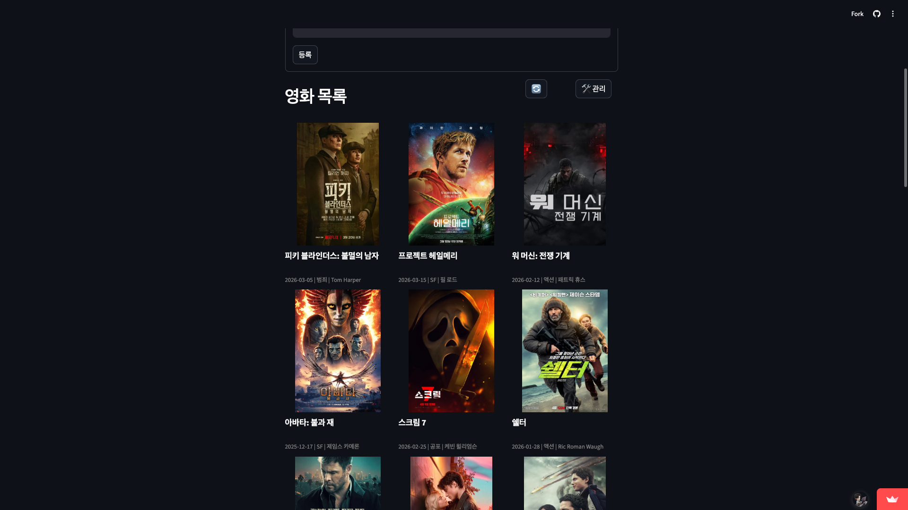
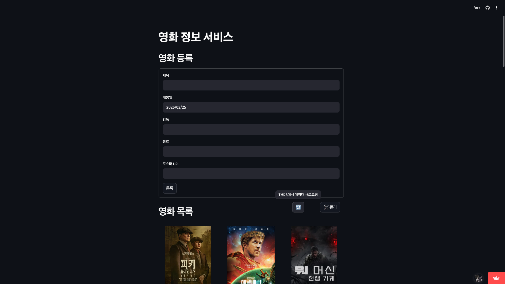
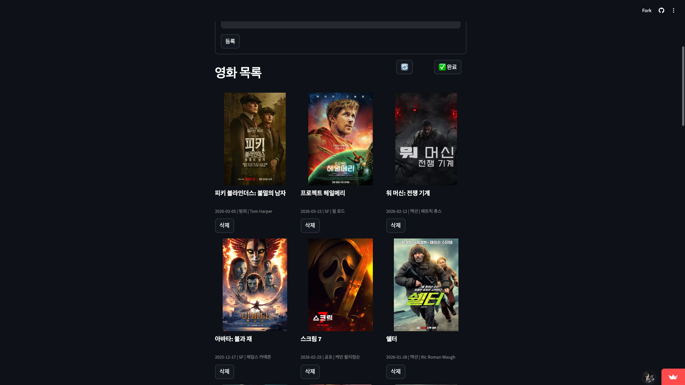
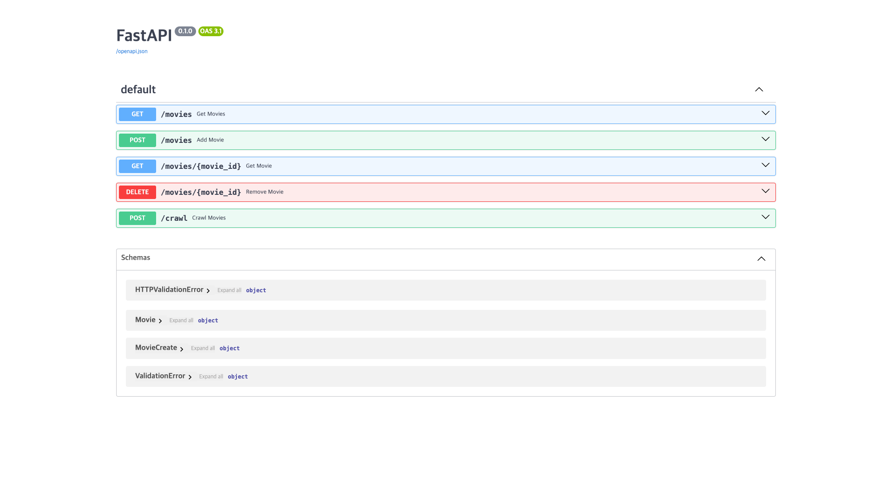

# 스프린트 미션 18 보고서 — 영화 정보 서비스

---

## 1. 서비스 개요

TMDB API를 활용해 인기 영화 데이터를 수집하고, 영화 목록 조회·등록·삭제 기능을 제공하는 웹 애플리케이션입니다.

- **프론트엔드**: Streamlit (Streamlit Cloud 배포)
- **백엔드**: FastAPI (Render 배포)
- **데이터**: TMDB popular API 기반 영화 30개 (파일 기반 저장)
- **서비스 URL**: https://p4v8j2ktcapptsprgt3fpkg.streamlit.app/
- **백엔드 URL**: https://one8-movies.onrender.com
- **TMDB 토큰 유효기간**: 2026-04-03까지

---

## 2. 서비스 구조도

```
[사용자 브라우저]
      │
      ▼
[Streamlit Cloud]          ← frontend/streamlit.py
      │  HTTP 요청
      ▼
[Render - FastAPI 서버]    ← backend/backend.py
      │
      ├── GET  /movies           전체 영화 조회
      ├── GET  /movies/{id}      특정 영화 조회
      ├── POST /movies           영화 등록
      ├── DELETE /movies/{id}    영화 삭제
      └── POST /crawl            TMDB 크롤링 실행
                │
                ▼
          [TMDB API]             ← backend/crawler.py
                │
                ▼
          [data/movies.json]     ← 파일 기반 DB
```

---

## 3. 데이터베이스 구조 (ERD)

파일 기반 저장소(`data/movies.json`)를 사용합니다.

### Movie

| 필드 | 타입 | 설명 |
|---|---|---|
| id | int | 자동 증가 식별자 |
| title | str | 영화 제목 |
| release_date | date | 개봉일 (YYYY-MM-DD) |
| director | str | 감독 이름 |
| genre | str | 장르 |
| poster_url | str | 포스터 이미지 URL |

> 심화 기능(리뷰, 감성 분석)은 미구현으로 Review 테이블 없음

---

## 4. API 명세 (FastAPI Docs)

베이스 URL: `https://one8-movies.onrender.com`

| 메서드 | 경로 | 설명 | 응답 코드 |
|---|---|---|---|
| GET | `/movies` | 전체 영화 목록 조회 | 200 |
| GET | `/movies/{id}` | 특정 영화 조회 | 200 / 404 |
| POST | `/movies` | 영화 등록 | 201 |
| DELETE | `/movies/{id}` | 영화 삭제 | 204 / 404 |
| POST | `/crawl` | TMDB에서 영화 30개 수집 | 200 |

> FastAPI Docs 전체 캡처 첨부 (아래 섹션 참고)

---

## 5. 주요 구현 내용

### 5-1. 크롤러 (`backend/crawler.py`)
- TMDB `popular` 엔드포인트로 영화 목록 수집
- `credits` 엔드포인트로 감독 정보 별도 조회
- 결과를 `data/movies.json`에 저장
- 백엔드 시작 시 자동 로드, `/crawl` 엔드포인트로 재수집 가능

### 5-2. 백엔드 (`backend/backend.py`)
- FastAPI 기반 REST API
- 인메모리 딕셔너리 + 파일(`movies.json`) 이중 저장
- 등록·삭제 시 즉시 파일에 반영
- Pydantic 모델로 입력(`MovieCreate`) / 응답(`Movie`) 분리

### 5-3. 프론트엔드 (`frontend/streamlit.py`)
- 영화 카드 3열 그리드 레이아웃
- CSS로 포스터·제목·캡션 고정 높이 처리 (카드 정렬)
- 관리 모드 토글 시에만 삭제 버튼 표시
- 🔄 버튼으로 백엔드 크롤링 트리거

---

## 6. 테스트 결과

```
pytest tests/test_backend.py -v

tests/test_backend.py::test_add_movie                   PASSED
tests/test_backend.py::test_add_movie_auto_increment_id PASSED
tests/test_backend.py::test_get_movies_empty            PASSED
tests/test_backend.py::test_get_movies                  PASSED
tests/test_backend.py::test_get_movie                   PASSED
tests/test_backend.py::test_get_movie_not_found         PASSED
tests/test_backend.py::test_delete_movie                PASSED
tests/test_backend.py::test_delete_movie_not_found      PASSED

8 passed in 0.18s
```

---

## 7. 서비스 동작 캡처

### 영화 목록


### 영화 등록 폼


### 관리 모드 (삭제 버튼 표시)


### FastAPI Docs

